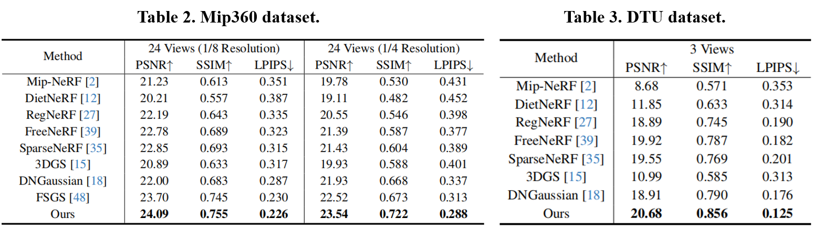
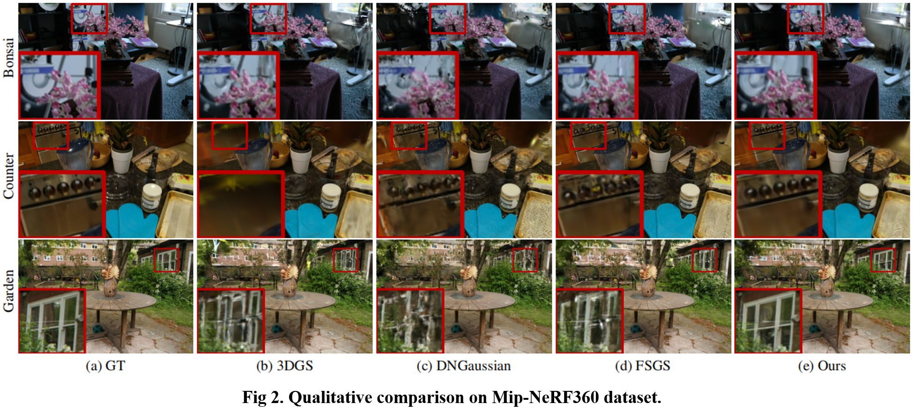

<div align="center">

<h1>LoopSparseGS: Loop Based Sparse-View Friendly Gaussian Splatting </h1>

<div>
    Zhenyu Bao<sup>1</sup> Guibiao Liao<sup>1,* </sup>, Kaichen Zhou<sup>1</sup>, Kanglin Liu<sup>2</sup>,  Qing Li<sup>2,* </sup> , Guoping Qiu<sup>3</sup>
</div>

<div>
    <sup>1</sup>Peking University    <sup>2</sup>Pengcheng Laboratory    <sup>3</sup>University of Nottingham
</div>

<div>
    <sup>*</sup>corresponding author
</div>

### [Paper](https://arxiv.org/abs/2408.00254) | [Project](https://zhenybao.github.io/LoopSparseGS) | Video | Code ( is coming soon... )

</div>


# Quantitative comparison





# Qualitative comparison





## Citation

Cite as below if you find this repository is helpful to your project:
```
@article{bao2024loopsparsegs,
      title={LoopSparseGS: Loop Based Sparse-View Friendly Gaussian Splatting},
      author={Bao, Zhenyu and Liao, Guibiao and Zhou, Kaichen and Liu, Kanglin and Li, Qing and Qiu, Guoping},
      journal={arXiv preprint arXiv:2408.00254},
      year={2024},
    }
```