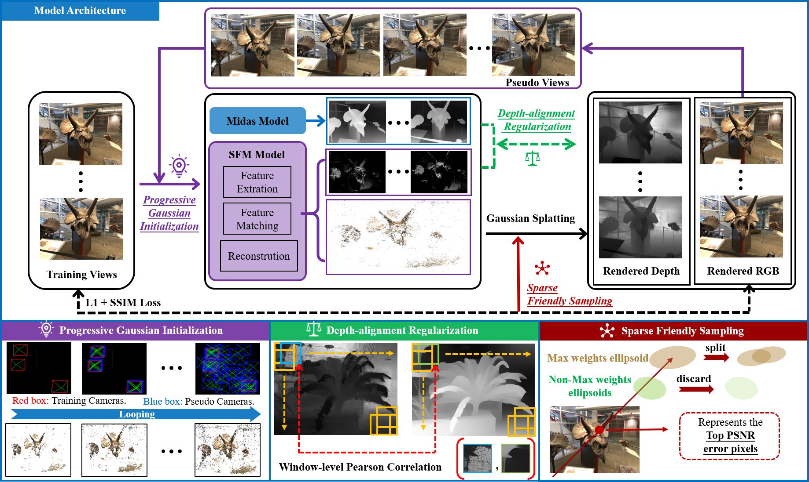

# LoopSparseGS: Loop Based Sparse-View Friendly Gaussian Splatting

The official repository of LoopSparseGS.

[Paper](https://arxiv.org/abs/2408.00254) | Project | Dataset



## 3-View Novel View Synthesis


## Citation
Cite as below if you find this repository is helpful to your project:
```
@misc{bao2024loopsparsegsloopbasedsparseview,
      title={LoopSparseGS: Loop Based Sparse-View Friendly Gaussian Splatting}, 
      author={Zhenyu Bao and Guibiao Liao and Kaichen Zhou and Kanglin Liu and Qing Li and Guoping Qiu},
      year={2024},
      eprint={2408.00254},
      archivePrefix={arXiv},
      primaryClass={cs.CV},
      url={https://arxiv.org/abs/2408.00254}, 
}
```