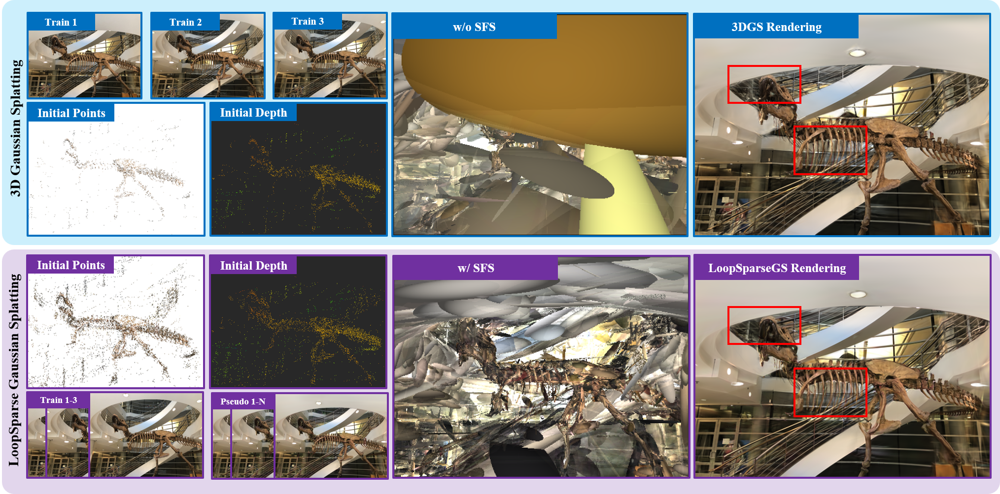

<div align="center">

<h1>LoopSparseGS: Loop Based Sparse-View Friendly Gaussian Splatting </h1>

<div>
    Zhenyu Bao<sup>1</sup>&emsp;
    Guibiao Liao<sup>1, *</sup>&emsp;
    Kaichen Zhou<sup>1</sup>&emsp;
    Kanglin Liu<sup>2</sup>&emsp;
    Qing Li<sup>2, *</sup>&emsp;
    Guoping Qiu<sup>3</sup>
</div>

<div>
    <sup>1</sup>Peking University&emsp;
    <sup>2</sup>Pengcheng Laboratory&emsp;
    <sup>3</sup>University of Nottingham
</div>

<div>
    <sup>*</sup>corresponding author
</div>

### [Paper](https://arxiv.org/abs/2408.00254) | [Project](https://zhenybao.github.io/LoopSparseGS) | Results

</div>


<br>

## Brief Intro
>**3D Gaussian Splatting in Sparse Setting**: Despite the photorealistic novel view synthesis (NVS) performance achieved by the original 3D Gaussian splatting (3DGS), its rendering quality significantly degrades with sparse input views. This performance drop is mainly caused by several challenges. Firstly, given the sparse input views, the initial Gaussian points provided by Structure from Motion (SfM) can be sparse and inadequate, as shown in follow figure (top left). Secondly, reconstructing the appearance and geometry of scenes becomes an under-constrained and ill-posed issue with insufficient inputs with only the image reconstruction constraints. Thirdly, the scales of some Gaussians grow to be very large during the optimization process, and these oversized Gaussian ellipsoids result in the overfitting problem, thus producing unsatisfactory results at novel viewpoints as illustrated in follow figure (top middle).

<br>



<br>

>**LoopSparseGS Method**: LoopSparseGS is a loop-based 3DGS framework for the sparse novel view synthesis task. In specfic, we propose a loop-based Progressive Gaussian Initialization (PGI) strategy that could iteratively densify the initialized point cloud using the rendered pseudo images during the training process. Then, the sparse and reliable depth from the Structure from Motion, and the window-based dense monocular depth are leveraged to provide precise geometric supervision via the proposed Depth-alignment Regularization (DAR). Additionally, we introduce a novel Sparse-friendly Sampling (SFS) strategy to handle oversized Gaussian ellipsoids leading to large pixel errors.

<br>

## Prerequisites
### 1.1  Equipment

We have validated our code on the following equipment:

- Unbuntu 18.04  or Win 11
- Py 3.8 + cuda 11.3 + torch 11.7
- colmap >= 3.7

### 1.2  Setup

Please run the following commands to clone the repository and install the required packages.
If COLMAP is not installed in your environment, please follow the [official instructions](https://colmap.github.io/install.html).
```
git clone https://github.com/pcl3dv/LoopSparseGS.git
cd LoopSparseGS

conda env create --file environment.yml
conda activate loopsparsegs
```

### 1.3  Data Preparation
Download LLFF from [offical link](https://drive.google.com/drive/folders/128yBriW1IG_3NJ5Rp7APSTZsJqdJdfc1) or [mirrored link](https://drive.google.com/file/d/11PhkBXZZNYTD2emdG1awALlhCnkq7aN-/view). Make sure the downloaded data is located at `data/nerf_llff_data/scene`.

Before training, please run the following code for acquiring the initial `n-views colmap files` and `projected depths`.
```
cd LoopSparseGS
python tools/pre_llff.py
```


## Training
The training paradigm is:
`training `-> `looping` -> `training` -> `looping` -> `training` ... 

### 2.1  Training and Looping
**Scripts**: You can run the script file to train the LLFF scenes (*e.g.* fern).

```
cd LoopSparseGS
bash script/train_llff.sh fern
```

**Parameter explanations**: Key parameters used in the `training` (`train.py`) and `looping` (`loop.py`) phases are described below.


For `train.py`:
* `--train_sub`: Number of training views.
* `--exp_name`: The output files would be saved in *output/${exp_name}*.
* `--pseudo_loop_iters`: Current loop round.
* `--pseudo_nums_per_img`: The number of new pseudo-views around each training view.
* `--patch_length`: The windows length in DAR method.
* `-sps/--sparse_sampling`: Enable sparse-friendly sampling.

For `loop.py`:
* `-m/--model_path`: Path to the latest training output directory.
* `-p/--pseudo_loop_iters`: Loop round of the lastest training.


### 2.2  Render
The `render` process runs automatically at the end of each `training` phase.
Use the following command if you need to render again manually.

```
python render.py -m output/fern --skip_train --render_depth
```

### 2.3  Evaluation
During the `training` process, we record metrics every 1000 epochs and store them in `$model_path$/record_psnr.txt`.
The following code can be used for any additional processing needs.
```
python metrics.py -m ./output/fern
```


## TODO list
- [x] release the code of the training and looping
- [ ] release the code for training custom data
- [ ] release the results reported on our paper.


## Acknowledgement

This work was inspired by [3DGS](https://github.com/graphdeco-inria/gaussian-splatting) and [FSGS](https://github.com/VITA-Group/FSGS). Thanks for their great projects.


## Citation

Cite as below if you find this repository is helpful to your project:
```
@article{bao2024loopsparsegs,
      title={LoopSparseGS: Loop Based Sparse-View Friendly Gaussian Splatting},
      author={Bao, Zhenyu and Liao, Guibiao and Zhou, Kaichen and Liu, Kanglin and Li, Qing and Qiu, Guoping},
      journal={arXiv preprint arXiv:2408.00254},
      year={2024},
    }
```